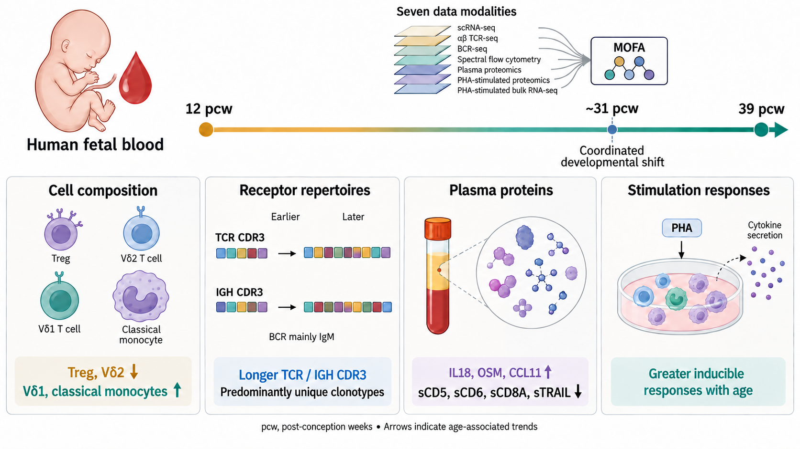

# Fetal Immune Atlas

Analysis code for **Atlas of the immune cell development in the human fetal blood**.

## Study summary

Human fetal blood changes substantially as the immune system develops. This study combines single-cell RNA sequencing, paired T-cell and B-cell receptor sequencing, spectral flow cytometry, plasma proteomics, and proteomic and transcriptomic measurements of stimulated PBMCs across approximately 12–39 post-conception weeks (pcw).

Treg and Vδ2 cell abundance declines with age, whereas Vδ1 cells and classical monocytes become more abundant. TCR and immunoglobulin heavy-chain CDR3 sequences lengthen, alongside increasing repertoire diversity; most clonotypes remain unique, and BCRs are predominantly IgM. Plasma proteins show distinct age-associated changes, while PHA-stimulated PBMCs show greater inducible responses later in development. Integration of the seven data modalities with MOFA identifies a coordinated developmental shift around 31 pcw. Together, these results describe the changing balance between immune tolerance and functional maturation in fetal blood.



*Schematic summary of the principal findings. Arrows show age-associated trends. Sequence strips illustrate relative CDR3 length, with no numerical scale. The shift near 31 pcw is the developmental pattern identified by the integrated analysis.* [PDF](docs/figures/graphical_abstract.pdf)

## Analyses by figure

| Figure | Analysis |
|---|---|
| [Figure 1](Main_Figure_01) | Blood and tissue cell atlas, sample coverage and cell composition |
| [Figure 2](Main_Figure_02) | Age-associated cell composition and transcriptional programs |
| [Figure 3](Main_Figure_03) | Developmental changes in inferred cell–cell communication |
| [Figure 4](Main_Figure_04) | TCR gene usage, CDR3 composition and clonotypes |
| [Figure 5](Main_Figure_05) | BCR gene usage, CDR3 composition, isotypes and clonotypes |
| [Figure 6](Main_Figure_06) | Spectral flow-cytometry populations and age associations |
| [Figure 7](Main_Figure_07) | Plasma proteins and stimulated-PBMC responses |
| [Figure 8](Main_Figure_08) | MOFA integration and the fetal blood developmental factor |
| [Supplementary Figure 1](Supplementary_Figures/Supplementary_Figure_01) | Cell-type marker expression and weighted abundance across tissues |
| [Supplementary Figure 2](Supplementary_Figures/Supplementary_Figure_02) | Tissue-specific UMAPs of blood, liver, thymus and spleen cells |
| [Supplementary Figure 3](Supplementary_Figures/Supplementary_Figure_03) | Cell-lineage UMAPs and TCR/BCR detection in the atlas |
| [Supplementary Figure 4](Supplementary_Figures/Supplementary_Figure_04) | Gene expression programs during erythropoiesis |
| [Supplementary Figure 5](Supplementary_Figures/Supplementary_Figure_05) | Integration and cell-composition comparison of fetal and cord blood |
| [Supplementary Figure 6](Supplementary_Figures/Supplementary_Figure_06) | Differential expression and pathway enrichment in CXCR5-positive and CXCR5-negative naive B cells across tissues |
| [Supplementary Figure 7](Supplementary_Figures/Supplementary_Figure_07) | NK-cell RNA velocity and CellRank transition probabilities |
| [Supplementary Figure 8](Supplementary_Figures/Supplementary_Figure_08) | NicheNet ligand–receptor interaction potentials in CX3CR1-positive and CXCR6-positive NK cells |
| [Supplementary Figure 9](Supplementary_Figures/Supplementary_Figure_09) | Early–late differences in incoming signaling to naive CD8 T and NKT cells |
| [Supplementary Figure 10](Supplementary_Figures/Supplementary_Figure_10) | Age-associated changes in TRA and TRB CDR3 segment lengths |
| [Supplementary Figure 11](Supplementary_Figures/Supplementary_Figure_11) | TCR clonal expansion and clonotype distribution across samples, tissues and cell types |
| [Supplementary Figure 12](Supplementary_Figures/Supplementary_Figure_12) | Age-associated changes in IGH, IGK and IGL CDR3 segment lengths |
| [Supplementary Figure 13](Supplementary_Figures/Supplementary_Figure_13) | Spectral flow-cytometry gating strategies and immune-cell hierarchy |
| [Supplementary Figure 14](Supplementary_Figures/Supplementary_Figure_14) | Spectral flow-cytometry UMAPs by tissue and sample |
| [Supplementary Figure 15](Supplementary_Figures/Supplementary_Figure_15) | Comparison of cell-type composition measured by spectral flow cytometry and scRNA-seq |
| [Supplementary Figure 16](Supplementary_Figures/Supplementary_Figure_16) | Age associations of Olink-panel gene expression in stimulated-PBMC bulk RNA-seq |
| [Supplementary Figure 17](Supplementary_Figures/Supplementary_Figure_17) | Temporal expression programs and GO enrichment in stimulated PBMCs |
| [Supplementary Figure 18](Supplementary_Figures/Supplementary_Figure_18) | Top positive and negative MOFA Factor 3 feature weights across data modalities |

Supplementary analyses are grouped in [Supplementary_Figures](Supplementary_Figures), with one folder for each of Supplementary Figures 1–18. The [panel index](00_Settings/00_Panel_Code_Index.tsv) lists all panel directories. Each panel has analysis scripts in `01_Code`. Its README links to the plotting tables in `00_Global_Data/Shared_Inputs` and lists additional inputs in `03_PlotData`.

## Data and setup

Study data are deposited in [Figshare: 10.6084/m9.figshare.34003890](https://doi.org/10.6084/m9.figshare.34003890). The Figshare dataset will be made publicly available upon publication of the associated article. [Shared data](00_Global_Data) include the expression tables, sample metadata, fitted models and intermediate analysis tables. Download the cell atlas (`Fetal_Immune_Atlas.h5ad`), TCR/BCR h5ad objects and assay measurements from Figshare into `00_Global_Data` as described in the [setup guide](00_Settings/README.md). The [input-file list](00_Settings/00_External_Data_Dependencies.tsv) records larger inputs and the locations expected by the scripts. Input locations in its `path` column are relative to the repository root.

The [setup guide](00_Settings/README.md) covers data placement, R package versions, shared library settings and figure colors. To compare installed R packages with the specified versions, run from the repository root:

```sh
Rscript 00_Settings/00_setup_R.R
```

Open the README for the figure of interest and follow its script descriptions. Shared analyses may produce several related panels. Figure 1a and Figure 8a are study schematics; Supplementary Figure 13 contains the experimental flow-cytometry gates and their hierarchy.

The expression datasets are supplied separately as `Fetal_Immune_Atlas_scRNA_Pseudobulk_TPM.csv` (21 PBMC samples) and `Fetal_Immune_Atlas_PHA_Bulk_TPM.csv` (16 stimulated PBMC samples). They are stored in `00_Global_Data`. Figure 2e uses its saved manuscript stage averages; Supplementary Figure 17 starts from the corresponding bulk counts and gene lengths. These inputs and the saved model results are described in [Shared analysis inputs](00_Global_Data/Shared_Inputs/README.md).

Shared plotting tables are stored in `00_Global_Data/Shared_Inputs`, arranged by figure and panel. Panel READMEs link to these files; other plotting inputs remain in each panel's `03_PlotData` directory.
